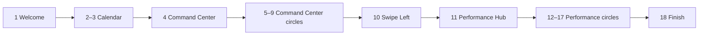
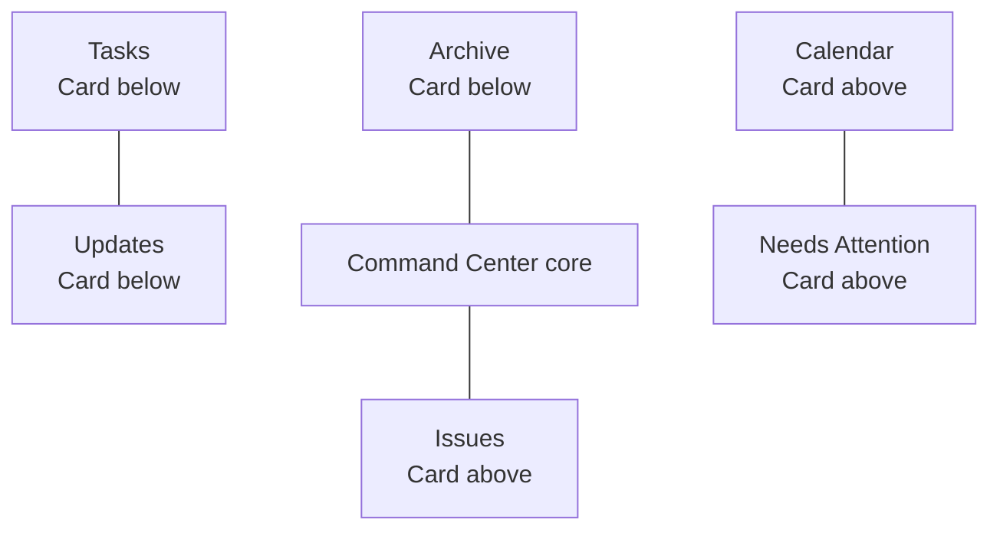

# Business Cadence — Current Tour Storyboard

**Purpose.** This document maps the onboarding sequence exactly as it is currently defined in the Business Cadence source. It is a **current-state storyboard**, not a recommendation for the redesign. It shows the order, target, message, and intended card placement so the next design can be changed deliberately rather than piecemeal.

> **Current structure:** 20 coach-mark steps across two hubs. The tour starts by explaining the business rhythm and calendar, moves through the Command Center, asks the user to swipe to the Performance Hub, then explains the Performance Hub and ends with a motivational close. [1]

## Interaction Rules Used Throughout

| Element | Current behavior |
|---|---|
| Backdrop | The active app screen is dimmed; one target is cut out and highlighted. |
| Coach mark | One card is intended to render at a time, with a step indicator, **Skip tour**, explanatory copy, and a single **Continue** or **Finish tour** control. |
| First-time entry | The tour is started after the user reaches the board for the first time. |
| Replay entry | Settings can reset the stored completion state and begin the same tour from Step 1. |
| Completion | The last action closes the tour and stores completion locally. |

For the Command Center circles, the current placement rule is explicit: **Tasks, Archive, and Updates** are paired with a card below; **Calendar, Issues, and Needs Attention** are paired with a card above. The **Swipe Left** prompt is also given the upper position whenever that preserves its cue and action row. [2]

## Act I — Establish the Operating Rhythm

| Step | Screen / highlighted target | On-screen message | Intended user takeaway |
|---:|---|---|---|
| 1 | Command Center core | **Welcome to BusinessCadence** — “Your business runs on rhythm. Two hubs, one mission…” | This is a shared operating system for the couple’s business. |
| 2 | Calendar circle | **Your Year at a Glance** — scheduled meetings become daily huddles, weekly reviews, monthly check-ins, and quarterly offsites. | Cadence is built from a reliable calendar of conversations. |
| 3 | Calendar circle again | **Color-Coded Cadence** — purple, teal, green, and red represent different meeting types. | The schedule is visual and becomes automatic after setup. |

> **Storyboard observation:** The tour uses two consecutive moments on the same Calendar circle before it names the Command Center. This makes the calendar the first concrete feature the user sees. [1]

## Act II — Introduce the Command Center

| Step | Screen / highlighted target | On-screen message | Intended card position |
|---:|---|---|---|
| 4 | Command Center core | **Command Center** — every circle is a category and can be tapped to dive in. | Adaptive, based on available space |
| 5 | Tasks | **Tasks** — assign work, complete it, and notify the partner. | **Below** |
| 6 | Updates | **Updates** — share wins, progress, and important business news. | **Below** |
| 7 | Issues | **Issues** — log problems, flag urgency, and keep friction out of personal time. | **Above** |
| 8 | Needs Attention | **Needs Attention** — a combined view of open tasks and unresolved issues. | **Above** |
| 9 | Archive | **Archive** — completed and resolved work becomes a shared record. | **Below** |

### Command Center Spatial Storyboard

The diagram is a placement guide rather than a literal screen layout. The important intent is that the coach mark sits **on the open side of the highlighted circle**, keeping the circle, title, instructional copy, and action control in view together.

## Act III — Move Between Hubs

| Step | Screen / highlighted target | On-screen message | Intended card position |
|---:|---|---|---|
| 10 | Horizontal hub-swipe cue | **Swipe Left → Performance Hub** — swipe to unlock goals, KPIs, reports, and more. | **Above** the swipe cue when possible |
| 11 | Performance Hub core | **Performance Hub** — track how the business is actually doing. | Adaptive, based on available space |

> **Storyboard observation:** This is the only instructional moment that asks the user to perform a gesture rather than simply continue. It is the bridge between the operational Command Center and the strategic Performance Hub. [1]

## Act IV — Introduce the Performance Hub

| Step | Screen / highlighted target | On-screen message | Intended user takeaway |
|---:|---|---|---|
| 12 | Goals | **Goals** — set shared targets and track progress together. | The couple agrees on what winning means. |
| 13 | KPIs | **KPIs** — track the facts that show business health. | Performance is measured together, not assumed. |
| 14 | Reports | **Reports** — create weekly snapshots for review. | Reflection has a consistent shared record. |
| 15 | Co-Owner Inbox | **Co-Owner Inbox** — keep asynchronous business messages out of personal texts. | Business communication has a dedicated place. |
| 16 | Settings | **Settings** — customize schedule, profile, and notifications. | The system can fit the partnership’s operating style. |
| 17 | Refer a Friend | **Refer a Friend** — share the system with another business-owning couple. | The referral offer is presented after value has been explained. |

## Act V — Close

| Step | Screen / highlighted target | On-screen message | Intended action |
|---:|---|---|---|
| 18 | Overall hub container | **You’re Ready** — the business now has a heartbeat, structured meetings, shared goals, and a clear cadence. | **Finish tour** closes onboarding. |

## Progression at a Glance

| Story chapter | Steps | Number of coach marks | Core job |
|---|---:|---:|---|
| Welcome and calendar rhythm | 1–3 | 3 | Explain why cadence matters. |
| Command Center introduction | 4–9 | 6 | Explain day-to-day operational circles. |
| Hub transition | 10–11 | 2 | Teach the swipe and introduce strategic context. |
| Performance Hub introduction | 12–17 | 6 | Explain goal-setting, measurement, communication, and setup circles. |
| Closing | 18 | 1 | End on the product promise. |
| **Total** | **1–18** | **18** | The source currently enumerates 18 steps; the earlier “20” display naming reflects prior copy and should be treated as a redesign cleanup item. |

## What the Current Story Is Trying to Say

The current tour tells a coherent high-level story: **create a rhythm → organize work → move between operations and performance → finish with shared alignment**. Its strongest messages are the distinction between business work and personal relationship space, shared visibility between owners, and a recurring meeting cadence.

However, it distributes that story across many individual feature explanations. Before a significant redesign, the main strategic decision is whether the new tour should remain a **complete feature map** or become a shorter **first-success path** that gets the couple to one immediate shared action—such as inviting a co-owner, setting the first weekly meeting, or creating the first shared goal.

## Redesign Decisions to Make Next

| Decision | Current state | Question for redesign |
|---|---|---|
| Tour length | 18 explanatory moments | What is the minimum number of screens needed for a first-time owner to succeed? |
| First promise | Calendar rhythm | Should the tour open with the relationship/business problem, the shared calendar, or a concrete first action? |
| Circle explanations | Every major circle is narrated | Should circles be introduced as grouped systems rather than one-by-one? |
| Swipe interaction | Gesture is taught mid-tour | Should the hub transition be interactive, automatic, or deferred until after onboarding? |
| First success | No setup action is completed inside the tour | What should both co-owners accomplish before the tour ends? |
| Replay experience | Same full tour replays from Settings | Should Settings offer a shorter “Hub guide” rather than the complete onboarding flow? |

## Source Reference

[1]: https://github.com/businesscadenceapp/business-cadence-calendar/blob/a0018ea/client/src/contexts/TourContext.tsx#L37-L190 "Current tour step definitions"

[2]: https://github.com/businesscadenceapp/business-cadence-calendar/blob/a0018ea/client/src/lib/tour-placement.ts "Current explicit Command Center card-placement rules"
